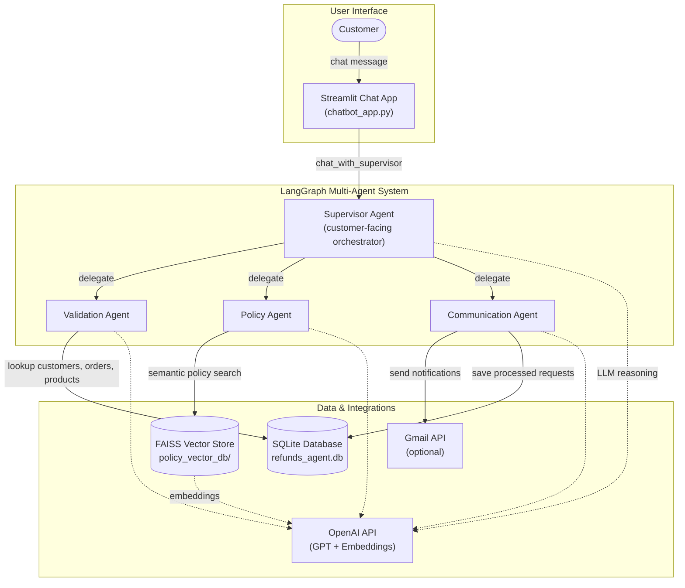

# Refund Request AI Agent

An intelligent customer-service system that handles refund, return, and exchange requests using a **multi-agent LangGraph workflow**. A supervisor agent coordinates three specialized agents—validation, policy, and communication—backed by a SQLite order database, a FAISS vector store of company SOP documents, and optional Gmail notifications.

## Architecture



### Request flow

1. **Customer chat** — The user describes their issue in the Streamlit chat interface.
2. **Supervisor routing** — The supervisor collects context (email, order, issue) and delegates one step at a time to the right specialist agent.
3. **Validation** — Looks up the customer, order history, product details, and prior refund requests in SQLite.
4. **Policy** — Retrieves relevant return windows, refund rules, tier benefits, and exception procedures from the FAISS vector store (built from SOP markdown documents).
5. **Communication** — Sends a confirmation email (via Gmail, if configured), logs the interaction, and persists the final decision to the database.
6. **Response** — The supervisor replies to the customer with the outcome and next steps.

---

## What This Project Does

This project simulates an e-commerce customer-support workflow for **refunds, returns, and exchanges**. Instead of a single monolithic chatbot, it uses a **supervisor + specialist agent** pattern:

| Agent | Role | Tools |
|-------|------|-------|
| **Supervisor** | Talks to the customer, remembers conversation history, and delegates work | Routes to specialist agents |
| **Validation Agent** | Verifies customer identity and order details | Customer/order/product lookups, duplicate refund checks |
| **Policy Agent** | Applies company rules to approve, reject, or escalate | FAISS semantic search over SOP documents |
| **Communication Agent** | Notifies the customer and records the outcome | Gmail send, request logging, database persistence |

The system is designed to **ground decisions in real data** (database records and retrieved policies) rather than relying on the LLM to invent order or policy details.

Sample data includes ~1,000 customers, products across categories (Electronics, Clothing, Home & Garden, etc.), and order history. Policy documents live in `sop_documents/` and cover return eligibility, refund calculations, customer tier benefits, and exception handling.

---

## Technologies Used

| Category | Technology |
|----------|------------|
| **Agent orchestration** | [LangGraph](https://github.com/langchain-ai/langgraph), [langgraph-supervisor](https://github.com/langchain-ai/langgraph-supervisor) |
| **LLM framework** | [LangChain](https://github.com/langchain-ai/langchain) |
| **Language model** | OpenAI GPT-4o-mini (configurable) |
| **Embeddings** | OpenAI Embeddings (via LangChain) |
| **Vector database** | [FAISS](https://github.com/facebookresearch/faiss) (`faiss-cpu`) |
| **Relational database** | SQLite + SQLAlchemy |
| **Data processing** | Pandas, NumPy |
| **Web UI** | Streamlit |
| **Email (optional)** | Gmail API (`google-api-python-client`) |
| **Configuration** | YAML (`src/config.yaml`) |

---

## Requirements

### System

- **Python 3.12** (recommended; other 3.10+ versions may work but 3.12 is tested)
- Internet access for OpenAI API calls
- ~500 MB disk space for dependencies and vector index

### API keys & credentials

| Requirement | Required? | Notes |
|-------------|-----------|-------|
| **OpenAI API key** | Yes | Used for chat completions and policy embeddings |
| **Gmail API credentials** | No | Only needed if you want real email delivery; otherwise emails fall back to console output |

### Pre-built assets (included in repo)

- `data/` — CSV files for customers, products, and orders
- `sop_documents/` — Markdown SOP policy files
- `policy_vector_db/` — Pre-built FAISS index (can be regenerated)

---

## Project Structure

```
.
├── chatbot_app.py              # Streamlit chat UI (main entry point)
├── database_creation.py        # Creates SQLite DB and loads CSV data
├── langgraph_simple_helper.ipynb  # Intro notebook for LangGraph concepts
├── requirements.txt
├── data/
│   ├── customers.csv
│   ├── orders.csv
│   └── products.csv
├── sop_documents/              # Company policy documents (markdown)
├── policy_vector_db/           # FAISS index (generated or pre-built)
└── src/
    ├── agents.py               # Multi-agent system (supervisor + specialists)
    ├── config.yaml             # API keys and email settings
    ├── db_tools.py             # SQLite lookup tools
    ├── vector_db_tools.py      # FAISS policy search tools
    ├── vector_db_creation.py   # Builds FAISS index from SOP docs
    ├── email_tools.py          # Gmail integration tools
    └── model.py                # OpenAI model initialization
```

---

## Setup & Installation

### 1. Clone and enter the project

```sh
cd "/path/to/Build a Refund Request AI Agent using LangGraph and FAISS"
```

### 2. Create a virtual environment (Python 3.12)

#### macOS / Linux

```sh
python3.12 -m venv myenv
source myenv/bin/activate
pip install -r requirements.txt
```

#### Windows

```sh
python -m venv myenv
myenv\Scripts\activate
pip install -r requirements.txt
```

#### Multiple Python versions installed

Use an explicit interpreter to ensure Python 3.12:

```sh
# Windows
py -3.12 -m venv myenv

# macOS / Linux
python3.12 -m venv myenv
```

Then activate the environment and run `pip install -r requirements.txt` as above.

### 3. Configure credentials

Edit `src/config.yaml`:

```yaml
credentials:
  openai:
    api_key: your_openai_api_key_here

email:
  sender_email: your_gmail_address@gmail.com
```

The OpenAI key is **required**. The sender email is only used when Gmail integration is set up.

### 4. Initialize the SQLite database

From the project root (with the virtual environment active):

```sh
python database_creation.py
```

This creates `refunds_agent.db` and loads sample customers, products, and orders from `data/*.csv`.

### 5. Build or refresh the policy vector store (optional)

A pre-built index exists in `policy_vector_db/`. To rebuild it from SOP documents (e.g., after editing policies):

```sh
python src/vector_db_creation.py
```

This reads markdown files from `sop_documents/`, chunks them, embeds them with OpenAI, and saves the FAISS index.

### 6. (Optional) Set up Gmail for email notifications

1. Create a project in [Google Cloud Console](https://console.cloud.google.com/).
2. Enable the **Gmail API**.
3. Create OAuth 2.0 credentials (Desktop app) and download `credentials.json` to the **project root**.
4. On first email send, complete the browser OAuth flow; a `token.pickle` file will be saved for future runs.

If Gmail is not configured, the communication agent still works—it logs email content to the console as a fallback.

---

## Running the Project

### Streamlit chatbot (recommended)

From the project root with your virtual environment active:

```sh
streamlit run chatbot_app.py
```

Open the URL shown in the terminal (typically `http://localhost:8501`).

**Example conversation:**

1. Provide your email (use a sample from `data/customers.csv`, e.g. `danielle.johnson@email.com`).
2. Describe the issue with a specific order.
3. The supervisor will look up orders, check policies, and propose approve/reject/review.
4. Confirm to trigger email notification and database logging.

Use **Clear Conversation** in the sidebar to reset the session.

### Programmatic usage

```python
from src.agents import RefundProcessingSystem

system = RefundProcessingSystem(config_path="src/config.yaml")
response = system.chat_with_supervisor("I'd like a refund for my recent order.")
print(response)
```

### LangGraph helper notebook

Open `langgraph_simple_helper.ipynb` for a step-by-step introduction to tools, ReAct agents, and supervisor patterns—the same concepts used in the full refund system.

---

## Configuration Reference

| Setting | File | Description |
|---------|------|-------------|
| `credentials.openai.api_key` | `src/config.yaml` | OpenAI API key |
| `credentials.openai.model_name` | `src/model.py` defaults | Model ID (default: `gpt-4o-mini`) |
| `credentials.openai.temperature` | `src/model.py` defaults | Sampling temperature (default: `0.1`) |
| `email.sender_email` | `src/config.yaml` | From address for Gmail notifications |

---

## Troubleshooting

| Issue | Solution |
|-------|----------|
| `Configuration file 'src/config.yaml' not found` | Run commands from the project root; ensure `src/config.yaml` exists with a valid API key |
| `OpenAI API key not configured` | Set `credentials.openai.api_key` in `src/config.yaml` |
| `Vector database not available` | Run `python src/vector_db_creation.py` or verify `policy_vector_db/` exists |
| Database lookup failures | Run `python database_creation.py` to recreate `refunds_agent.db` |
| Gmail auth errors | Place `credentials.json` in project root; delete `token.pickle` and re-authenticate |
| Import errors from `src/` | Always run `chatbot_app.py` and scripts from the **project root** directory |

---

## Useful Links

Official installation guides and documentation for the tools used in this project.

### Python & environment

- [Python 3.12 downloads](https://www.python.org/downloads/) — Install Python 3.12
- [Python venv documentation](https://docs.python.org/3/library/venv.html) — Create and manage virtual environments
- [pip documentation](https://pip.pypa.io/en/stable/) — Install packages from `requirements.txt`

### Agent framework & LLM

- [LangGraph documentation](https://langchain-ai.github.io/langgraph/) — Graph-based agent orchestration
- [LangGraph GitHub](https://github.com/langchain-ai/langgraph) — Source and examples
- [langgraph-supervisor](https://github.com/langchain-ai/langgraph-supervisor) — Supervisor multi-agent pattern used in this project
- [LangChain documentation](https://python.langchain.com/docs/introduction/) — Tools, models, and integrations
- [LangChain OpenAI integration](https://python.langchain.com/docs/integrations/chat/openai/) — Chat models and embeddings
- [OpenAI API platform](https://platform.openai.com/) — API keys and usage dashboard
- [OpenAI API documentation](https://platform.openai.com/docs/overview) — Models, authentication, and rate limits

### Vector search & data

- [FAISS GitHub](https://github.com/facebookresearch/faiss) — Vector similarity search library
- [LangChain FAISS integration](https://python.langchain.com/docs/integrations/vectorstores/faiss/) — Building and querying FAISS indexes
- [SQLAlchemy documentation](https://docs.sqlalchemy.org/) — ORM used for the SQLite database
- [Pandas documentation](https://pandas.pydata.org/docs/) — CSV loading and data processing

### Web UI & configuration

- [Streamlit documentation](https://docs.streamlit.io/) — Chat UI framework
- [Streamlit installation](https://docs.streamlit.io/get-started/installation) — Run the chatbot locally
- [PyYAML documentation](https://pyyaml.org/wiki/PyYAMLDocumentation) — YAML config file format

### Email integration (optional)

- [Google Cloud Console](https://console.cloud.google.com/) — Create a project and enable APIs
- [Gmail API overview](https://developers.google.com/gmail/api/guides) — Send mail via OAuth
- [Gmail API Python quickstart](https://developers.google.com/gmail/api/quickstart/python) — OAuth setup and first send
- [google-api-python-client](https://github.com/googleapis/google-api-python-client) — Official Google API client for Python

---

## License

This project is provided for educational and demonstration purposes.
